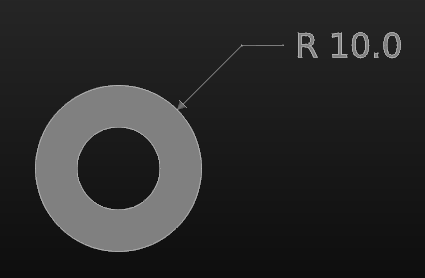

# cq-annotate

An annotation extension designed to work with the CadQuery parametric CAD API.

## Installation

This is not published on PyPI yet, but it can be installed from git via `pip`.

```
pip install git+https://github.com/jmwright/cq-annotate.git
```

## Modules

* `callouts` - Adds callouts like assembly arrows.
* `dimensioning` - Adds dimensions like diametral and radial dimensions.
* `overlays` - Adds overlays such as safety warnings.
* `views` - Adds ability to set the model up for various views, such as exploded views.

## Importing

The methods available from this package can be imported like so:
```python
from cq_annotate.callouts import add_assembly_arrows
from cq_annotate.dimensioning import add_circular_dimensions
from cq_annotate.views import explode_assembly
from cq_annotate.overlays import add_safety_warning
```

## Methods

* `callouts.add_assembly_arrows` - Automatically adds assembly arrows to faces in an assembly tagged "arrow". The arrow will face in the opposite direction of the normal of the face so that in something like an exploded assembly view the arrows should be indicating the direction to reassemble the assembly. The arrow size can be altered using the `arrow_scale_factor` parameter. More information can be found in the docstring for this method.
* `views.explode_assembly` - Creates an exploded view of an assembly by translating the parts of the assembly by the `explode_loc` value defined by the designer in the `metadata` parameter of each part. This requires more work on the part of the designer, but provides the proper level of control to ensure that exploded views look correct. More information can be found in the docstring for this method.
* `dimensioning.add_circular_dimensions` - Adds diametral and radial dimension objects as part of an assembly to a given model, based on tagged features. See the method's docstring for more information.
* `overlays.add_safety_warning` - Adds a safety overlay that can be overlaid on existing SVG content. See the method's docstring for more information.

## Examples

### Assembly Arrows
* [add_assembly_arrows_example.py](./examples/add_assembly_arrows_example.py) - A fully commented example showing a simple example of how to use assembly arrows.


### Assembly Lines
* [add_assembly_lines_example.py](./examples/add_assembly_lines_example.py) - Example showing a simple example of how to use assembly lines.


### Explode Assembly
* [explode_assembly_example.py](./examples/explode_assembly_example.py) - A fully commented example showing how a simple assembly can be set up to explode to show the individual components better. In the screenshot below, the two blocks would be touching at the origin if they were not set to be exploded.


### Circular Dimensions
* [circular_dimensions_example.py](./examples/circular_dimensions_example.py) - Shows a basic example of adding a diameter dimension (radius) to a hole.



### Safety Warning
* [safety_warning_example.py](./examples/safety_warning_example.py) - Adds a customizable safety warning to an existing SVG. The `test_add_safety_warning.svg` file can be copied from the `tests` directory and used with this example.

